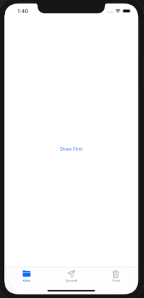

# StoryboardReference
스토리보드 레퍼런스(StoryboardReference) 사용방법 예제 프로젝트 입니다.

**예제 프로젝트 동작 이미지** 

 

**블로그 프로젝트 설명** 

[스토리보드 레퍼런스(Storyboard Reference) 사용방법](https://swieeft.github.io/StoryboardReference/)
